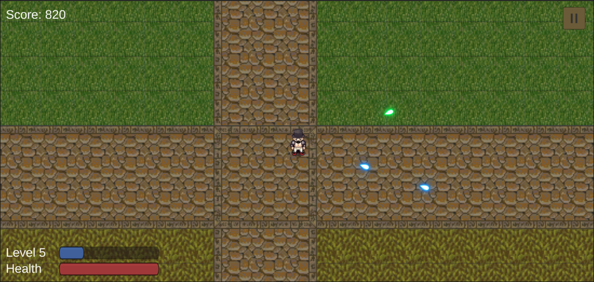

## How to set up
Ensure that you have git installed. Also ensure that you have Unity 2021.3.17f1 installed. Later versions may work as well, but that is the version the game was developed in. We have not tested it in other versions. Be sure to clone the repository into a desired folder. 
Open the project using unity hub. It may prompt you to install some extra things if it is your first time using Unity hub. The first open will take much longer than the rest due to Unity downloading necessary files. 

## How to play test
Unity hub should open the game to the main menu screen. YOU NEED TO START FROM THIS SCENE. If it does not open this screen, you can find it at Project 1/Assets/Scenes/MainMenu.unity. 

From here you have the option to either play a new game, load your previous save, check the instructions or quit the game. Your character will now spawn in the middle of the map to. Utilize WASD keys to move, and use your mouse cursor to aim your bullets. Enemies will spawn at different spots in the map and chase you. When they make contact with you, you will lose health, indicated at the bottom left. When you kill an enemy, they will drop an orb which will increase your character's experience and score. Once you reach 0 health, the game will end

## Creating the Main menu
The main menu was built using the UI builder provided by Unity. Check to see if this is installed for you. If it is not, you must install it by adding com.unity.ui.builder and com.unity.ui. 
You can use our UI object in our MainMenu scene to create a similar system to start new game, load save, instructions and quit the game. You just need to edit the names of the scenes in the MainMenuController.cs file to open the correct scenes and load the correct information. 

## Creating Instructions
The instructions scene consists of a background, text on top of an image, and a few buttons. You can opt to use this entire scene for your instructions. You can opt to change the images of the background, and the image the text is layed over to match your game. You can do this by just changing the source images. The buttons will work no matter what, but is designed only for two pages of instructions. You can choose to edit the text game objects to suit the needs of the game. You can also change the videos of the demonstrations by changing the video clip in the corresponding VideoPlayer. 

## Creating your HUD